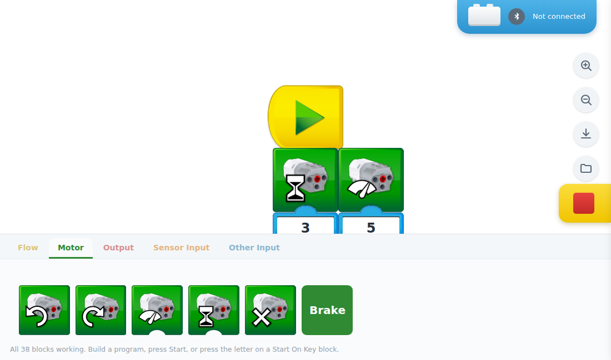
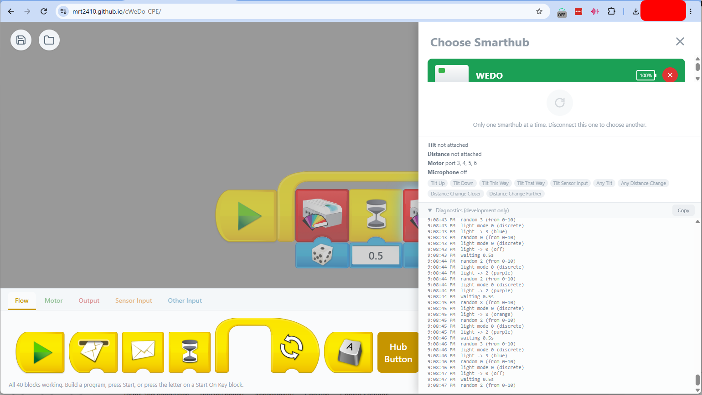

# cWeDo CPE

A browser-based visual programming app for the **LEGO® Education WeDo 2.0** Smarthub —
drag-and-drop blocks, connect over Bluetooth, and control the motor, light, and
sensors directly from a web page. No app store, no install, no build step.

<p align="center">
  <a href="https://mrt2410.github.io/cWeDo-CPE/" target="_blank" rel="noopener noreferrer">
    
  </a>
  <br>
  <sub>No install, no download — works in <b>Chrome, Edge, Opera, or Brave</b> (Web Bluetooth required for hub connection).</sub>
</p>

| Block editor | Hub connection panel |
| :---: | :---: |
|  |  |

## Why this exists

LEGO retired the WeDo 2.0 product line and, in January 2024, pulled the official
WeDo 2.0 companion app from the Apple App Store and Google Play. LEGO has said
existing downloads of the app will keep working until July 31, 2026, but there's
no path forward after that — and no official app at all for anyone setting up a
WeDo 2.0 hub for the first time today. A lot of WeDo 2.0 hardware is still out
there, in classrooms, clubs, and personal collections, with nothing left to
program it with.

The WeDo 2.0 Smarthub's actual Bluetooth protocol isn't proprietary in any
meaningful sense — [LEGO publishes it](https://lego.github.io/lego-ble-wireless-protocol-docs/),
and a community of hobbyists has been reverse-engineering and documenting it for
years. The [Web Bluetooth API](https://developer.chrome.com/docs/capabilities/bluetooth),
supported in Chromium-based browsers, means a plain web page can now talk to that
same hub directly — no companion app, no native install, works on a phone, tablet,
or laptop. **cWeDo CPE** is a from-scratch reimplementation of that idea: a
block-programming interface in the style of the original app, built for the open
web instead of an app store, so the hardware doesn't become e-waste just because a
mobile app got sunset.

It's an unofficial, community-built project — not affiliated with, endorsed by, or
supported by the LEGO Group.

## Features

- **Drag-and-drop block programming** — Scratch/ScratchJr-style blocks for motors,
  lights, sound, sensors, messaging, and control flow (Repeat, Wait, Start On Key
  Press, Start On Message, Start On Hub Button).
- **Full LEGO WeDo 2.0 hub support**, reverse-engineered against the published
  protocol and the community [LEGO-WeDo-2.0-Python-SDK](https://github.com/jannopet/LEGO-WeDo-2.0-Python-SDK):
  - Motor: run at a set power/direction, run for a duration, drift-stop, and
    instant brake — with the hub's real stall floor compensated so "low power"
    settings still actually move the motor.
  - Hub RGB light: the original 11-colour palette, plus a "Custom…" full RGB
    colour picker.
  - Piezo tone player: play a note (with octave) on the hub's own buzzer.
  - Tilt sensor and motion/distance sensor input, auto-detected on attach.
  - Hub button, wired up as both a programmable "Start" block and live telemetry
    (along with battery level and voltage/current) in the connection panel.
- **Tablet-side extras** that the original hardware never had: a virtual on-screen
  display widget with live math blocks, the tablet's own microphone as a sound
  sensor, and the tablet's speaker for sound playback (including your own custom
  recording).
- **Save As / Open** — export a program as a portable `.wedo.json` file and load
  it back later or on another device.
- **Autosave and auto-reconnect** — your program persists across a page reload,
  and the app automatically retries reconnecting to the last hub you used.
- **Zero build step, zero runtime dependencies** — the whole app is static
  HTML/CSS/JS. Open it straight from disk to build and edit programs, or serve it
  over `http://` for full Bluetooth support (see [Getting started](#getting-started)).

## Getting started

### Requirements

Web Bluetooth — needed to actually connect to a hub — only works in
**Chromium-based browsers**: Chrome, Edge, Opera, Brave. Firefox has never
implemented Web Bluetooth at all, and Safari/iOS doesn't support it either. The
rest of the app (building and editing programs) works in any modern browser.

### Run it

Just open [`cWeDo CPE v1.0.html`](cWeDo%20CPE%20v1.0.html) directly in a
Chromium-based browser — double-click it, or drag it into a browser tab. You can
build and edit programs immediately with no server at all.

To connect to a real hub, the page needs a "secure context" (`https://` or
`http://localhost`) — opening the file directly (`file://`) works for connecting
*on the same machine*, but if you want to reach it from another device on your
network, serve it locally instead:

```bash
python3 -m http.server 8000 --bind 0.0.0.0
```

then open `http://localhost:8000/` (or your machine's LAN IP from another
device). See [docs/bluetooth-lan-setup.md](docs/bluetooth-lan-setup.md) for the
extra one-time browser flag needed when connecting over a LAN IP instead of
`localhost`.

## Building the Android app

There's also a Docker-based build that packages the app as an installable
Android APK (using [Capacitor](https://capacitorjs.com/), so Bluetooth and
Save/Open work natively — Android's WebView doesn't support Web Bluetooth or
file downloads on its own, so a couple of small native-only shims bridge
those; see [docs/android-apk-build.md](docs/android-apk-build.md) for the
full explanation).

**Compatibility:** Android 7.0 (API 24) or newer — that's Capacitor's own
minimum, not something specific to this app, so it covers effectively every
Android device still in use. Built against API 36 (compile/target SDK).
Confirmed working (Bluetooth + Save/Open) on a Samsung Galaxy Tab A (2018,
Android 8.1/9).

Requires Docker. From the repo root:

```bash
docker compose build android-build
docker compose run --rm android-build
```

The APK is written to `release/cwedo-cpe-debug.apk` — install it with
`adb install release/cwedo-cpe-debug.apk`, or copy it to a device and allow
installs from unknown sources. It's an unsigned debug build, fine for
sideloading. Re-run the same two commands any time to rebuild after pulling
changes. See [docs/android-apk-build.md](docs/android-apk-build.md) for how
it works, iOS status, and troubleshooting.

## Project structure

```
cWeDo CPE v1.0.html   entry point (symlinked as index.html)
css/                  styles
data/                 sprite art, sound bank, background images (baked-in assets)
assets/               screenshots used in this README (not part of the shipped app)
js/
  app.js              engine: canvas rendering, drag/drop, dialogs, save/open,
                       autosave, Bluetooth connect/disconnect/reconnect
  blocks/             one file per block "device" (motor, rgb-light, tilt-sensor,
                       motion-sensor, piezo-tone-player, sound, display, messaging,
                       core.js for shared block-classification/dispatch)
  telemetry/          hub-internal, non-block sensors (button/battery, voltage/current)
  ble/                native Bluetooth shim, used only inside the packaged Android app
  native/             native file-storage shim, used only inside the packaged Android app
docs/                 design docs, feature write-ups, the LEGO-SDK feature inventory
test/                 the test suite (see below)
docker/               Dockerfile + build script for the Android APK build
docker-compose.yml    compose service definition for the Android APK build (docker/)
mobile/               Capacitor project config for the Android APK build
release/              gitignored build output (e.g. the Android APK)
```

No bundler, no framework, no `import`/`export` — every file is a plain
`<script src>` tag sharing one global scope, so the app keeps working if you
just open the HTML file with no server at all.

## Development

```bash
npm install
npm test
```

Tests run on Node's built-in test runner with [jsdom](https://github.com/jsdom/jsdom)
loading the real app files — no browser needed for most of the suite. Web
Bluetooth itself can't be exercised in jsdom, so Bluetooth-adjacent code is
tested at the byte-encoding/state-transition level instead, with real hardware
verification called out explicitly wherever it's still needed (see
[docs/io-inventory-vs-wedo2-sdk.md](docs/io-inventory-vs-wedo2-sdk.md)
for exactly what's confirmed vs. still an educated guess pending real hardware,
like a couple of hub port numbers).

Contributions are welcome.

## Known limitations

- Tilt Sensor angle mode (continuous degrees) and Motion Sensor count mode
  (counting objects passing) aren't implemented yet — only the original app's
  discrete tilt-direction and distance-detect modes are. See
  [docs/io-inventory-vs-wedo2-sdk.md](docs/io-inventory-vs-wedo2-sdk.md) for the
  full rundown of what's implemented vs. proposed.
- A few hub port numbers (the piezo buzzer, voltage sensor, current sensor) and
  whether the RGB light needs an explicit mode-switch command are documented,
  reasoned-through guesses that haven't been confirmed against a real hub yet —
  flagged everywhere they matter in code comments and docs. If you have a real
  WeDo 2.0 hub and can help confirm or correct these, that'd be a great first
  contribution.

## Community

Discussion, support, and updates for this project happen in the
[WeDo Facebook group](https://www.facebook.com/groups/letsdowedo/) — join in if
you have a WeDo 2.0 hub, questions, or want to help out.

## Thanks to

- The original **WeDo CPE** community effort this project continues and builds
  on — see [Angela Yang's announcement post](https://www.facebook.com/groups/letsdowedo/posts/3539358399565407)
  in the [WeDo Facebook group](https://www.facebook.com/groups/letsdowedo/).
- [jannopet/LEGO-WeDo-2.0-Python-SDK](https://github.com/jannopet/LEGO-WeDo-2.0-Python-SDK),
  the reference used throughout this project to confirm the hub's wire protocol
  for every block and feature.
- Everyone who reverse-engineered and documented the WeDo 2.0 Bluetooth protocol
  publicly over the years, and LEGO's own [published wireless protocol docs](https://lego.github.io/lego-ble-wireless-protocol-docs/).

## Support this project

If cWeDo CPE has been useful to you, consider chipping in to help keep it going.

<p align="center">
  <a href="https://www.paypal.com/donate/?business=DYZX2FMHZVULL&no_recurring=0&item_name=Support+for+WeDo+Project&currency_code=USD" target="_blank" rel="noopener noreferrer">
    
  </a>
</p>

## License

[MIT](LICENSE)

---

*LEGO® and WeDo® are trademarks of the LEGO Group, which does not sponsor,
authorize, or endorse this project.*
